# YANET2 — Target Architecture for yanet-operator

> This document describes the target architecture of yanet2 on a Kubernetes
> node that yanet-operator must be able to generate (CRD `v2alpha1`).
> Sources: yanet2 developers + production config samples from
> `/etc/yanet2/`.

## 1. Terminology

| Term | Meaning |
|---|---|
| **Module** | Code that obtains an *arena* from the dataplane and writes to shmem via the IPC namespace; compiles data into a binary format. May live either inside the `controlplane` or as a standalone process. Examples: `acl`, `route`, `decap`, `nat64`, `balancer`, `forward`. |
| **Operator** | Userspace wrapper around a module. Holds the pre-compilation ("source") state, supplies data to be compiled, talks gRPC with other entities (via `gateway`), and collects metrics. Examples: `yanet-pipeline-operator`, `yanet-route-operator`, `yanet-forward-operator`. |
| **Agent** | Same as an operator, but requires **direct access to the host IPC namespace** (`hostIPC: true`). From the CRD point of view it is identical to an operator — only the flag differs. Planned example: `antiddos`. |
| **Bundle** | A set of modules inside `controlplane` that work via shmem: `acl`, `route`, `decap`, `nat`, `balancer`. |
| **Built-in** | Services inside `controlplane` that do not perform networking tasks but are required to assemble the pipeline: `pipe`, `function`, `counters`, `inspect`, `logging`. They are auto-registered in the gateway (see [`gateway.go`](../yanet2/controlplane/internal/gateway/gateway.go:179)). |
| **Gateway** | gRPC + HTTP/gRPC-proxy inside `controlplane`. The registration entry point for external operators (`Register` in [`service.go`](../yanet2/controlplane/internal/gateway/service.go:63)) and the entry point for CLI / web / metrics-collector. |
| **NUMA-domain** | One `controlplane` per NUMA domain on the host (a separate Deployment) plus its own shmem arena in dataplane. |

## 2. Node Composition

### 2.1. Base data path / control path

| Component | Deployment | IPC / network | Config |
|---|---|---|---|
| `dataplane` (`yanet-dataplane`) | One Deployment per node | `hostNetwork: true`, `hostIPC: true`, hugepages, shmem `/dev/hugepages/yanet` | hostPath (`/etc/yanet2/dataplane.yaml`), as in v1 |
| `controlplane` (`yanet-controlplane-director`) | One Deployment **per NUMA domain** | gRPC `[::]:8080` / HTTP `[::]:8081` (inside the Pod), `hostIPC` (for shmem) | hostPath, inline or URL |
| `metrics-collector` | DaemonSet (out of yanet-operator scope in Phase 4) | gRPC to gateway service | — |

### 2.2. BIRD

| Component | Deployment | Wiring |
|---|---|---|
| `bird` (BIRD2) | Standalone Deployment | hostPath config (as in v1); shared volume `/run/bird` for the unix socket |
| `bird-adapter` (`yanet-bird-adapter`) | Standalone Deployment | shared `/run/bird` (reads BIRD socket); gRPC → gateway service and/or route-operator service |

> In the CRD, `bird` and `bird-adapter` are represented as **a single entity**:
> bird without an adapter is useless, and the adapter without bird is useless.
> Two distinct Deployments are kept so they can be upgraded independently.

### 2.3. Operators and Agents

The list comes from CRD field `OperatorsSpec.Items[]`.
For each item a separate Deployment + ClusterIP Service is created.
The link to `gateway` is bidirectional over gRPC: an operator registers itself in the gateway, and the gateway calls the operator back at the address of its Service.

| Operator | Binary | Example config file |
|---|---|---|
| pipeline | `yanet-pipeline-operator` | [`yanet-pipeline-operator.yaml`](../yanet2/agents/yanet-pipeline-operator) |
| route | `yanet-route-operator` | [`yanet-route-operator.yaml`](../yanet2/agents/yanet-route-operator) |
| forward | `yanet-forward-operator` | (see `yanet2/agents/yanet-forward-operator`) |
| acl | `yanet-operator-acl` | `/etc/yanet/operator-acl.yaml` |
| (planned) antiddos | operator + agent in one Pod | — |

An agent is functionally identical to an operator but requires `hostIPC: true`
(direct access to the host IPC namespace). Two deployment shapes are supported:

- **Single-container Deployment** — the most common case (`pipeline`, `route`,
  `forward`, `acl`). One container per Pod, optionally with `hostIPC: true`.
- **Multi-container Deployment** — needed when an operator and a paired agent
  must live in **the same Pod** (shared lifecycle, shared volumes, the same
  IPC/network namespaces). The reference case is `antiddos`: an `operator`
  container + an `agent` container with `hostIPC: true`.

The CRD therefore models each item via `containers[]` (see [`13-operators-spec.md`](YANET2_MIGRATION_PLAN/13-operators-spec.md) §4):
single-container is `containers: [{...}]`, multi-container is
`containers: [{name: operator, ...}, {name: agent, hostIPC: true, ...}]`.
The Pod-level `hostIPC` is set if **any** container in the list requests it.

### 2.4. Announcer (planned, shown on the diagram)

- Standalone Deployment.
- Watches host health and decides whether the node should be in service.
- Primary channel: gRPC to `gateway`.
- Additionally needs the **bird unix socket** (shared volume `/run/bird`)
  in order to withdraw the announcement when controlplane fails.

### 2.5. What yanet-operator does NOT deploy

- yanet-cli, web UI — external clients, they reach the gateway service.
- metrics-collector — separate DaemonSet (not covered in Phase 4).
- BIRD config — for now mounted from the host.

## 3. Service Topology

Created by yanet-operator:

| Service | Selector | Type / policy | Purpose |
|---|---|---|---|
| `controlplane-numa{N}` | `app=controlplane,numa=N,node=<host>` | ClusterIP, `internalTrafficPolicy: Local`, headless if needed | Pod-local operators and dataplane on the same node reach their controlplane |
| `controlplane-numa{N}-cluster` | `app=controlplane,numa=N` | ClusterIP, round-robin across all nodes | External clients (CLI, web, metrics-collector) reach the gateway of a specific NUMA domain across the cluster |
| `controlplane-all-cluster` | `app=controlplane` | ClusterIP, round-robin | Universal entry point for metrics-collector / CLI when NUMA affinity is irrelevant |
| `<operator>-svc` | `app=<operator>,node=<host>` | ClusterIP | Backconnect from gateway → operator (using its registered address) |
| `bird-svc` / `bird-adapter-svc` | `app=bird*` | ClusterIP | For debug / tooling |
| `announcer-svc` | `app=announcer` | ClusterIP | Internal |

## 4. Dependencies

- **Node Feature Discovery (NFD)** — optional helm-chart dependency.
  - `helm install -n node-feature-discovery --create-namespace nfd oci://registry.k8s.io/nfd/charts/node-feature-discovery --version 0.18.3`
  - The label `feature.node.kubernetes.io/cpu-numa_nodes_count` is used to determine how many controlplane Deployments to generate per node.
- Host requirements: hugepages, `hostNetwork`, `hostIPC` capability.

## 5. Mermaid diagram

> Simplified single-NUMA view (in production a node has N NUMA domains and N
> `controlplane` Deployments). Modules live **inside** `controlplane` (bundle).
> Operators are **separate Deployments** outside `controlplane`. The BIRD unix
> socket (`/run/bird`) is shared **only** with `bird-adapter` and `announcer`.

```mermaid
flowchart TB
    classDef host fill:#f5f5f5,stroke:#888,color:#000
    classDef cp fill:#dbeafe,stroke:#1d4ed8,color:#000
    classDef mod fill:#bfdbfe,stroke:#1e40af,color:#000
    classDef builtin fill:#e0e7ff,stroke:#4338ca,color:#000
    classDef dp fill:#fee2e2,stroke:#b91c1c,color:#000
    classDef op fill:#dcfce7,stroke:#15803d,color:#000
    classDef agent fill:#fef9c3,stroke:#a16207,color:#000
    classDef bird fill:#ede9fe,stroke:#6d28d9,color:#000
    classDef svc fill:#fff,stroke:#444,stroke-dasharray:3 2,color:#000
    classDef plan fill:#fff,stroke:#999,stroke-dasharray:5 4,color:#666

    subgraph TOP[" External & cluster-wide Services "]
        direction LR
        EXT["External clients<br/>cli / web / metrics-collector<br/>(not deployed by operator)"]:::plan
        SVCALL["Service: controlplane-all<br/>(cluster-wide RR)"]:::svc
        SVCNUMA["Service: controlplane-numa{N}-cluster<br/>(per-NUMA cluster-wide RR)"]:::svc
        EXT -->|gRPC/HTTP| SVCALL
        EXT -->|gRPC/HTTP| SVCNUMA
    end

    subgraph NODE[" K8s Node (single NUMA shown) "]
        direction LR

        HUGE[("hugepages<br/>/dev/hugepages/yanet")]:::host
        BIRDSOCK[("shared volume<br/>/run/bird")]:::host

        DP["dataplane Deployment<br/>hostNetwork + hostIPC + hugepages"]:::dp

        subgraph CP[" controlplane Deployment (per NUMA) "]
            direction TB
            GW["gateway<br/>:8080 gRPC / :8081 HTTP"]:::cp
            subgraph BUNDLE[" bundle (modules, shmem writers) "]
                MOD_ACL["acl"]:::mod
                MOD_ROUTE["route"]:::mod
                MOD_DECAP["decap"]:::mod
                MOD_NAT["nat"]:::mod
                MOD_BAL["balancer"]:::mod
            end
            subgraph BIN[" built-in (no networking) "]
                BI["pipe / function / counters /<br/>inspect / logging"]:::builtin
            end
        end

        SVCCP["Service: controlplane-numa{N}<br/>(per-node, internalTrafficPolicy: Local)"]:::svc
        SVCCP --- GW

        OP_PIPE["yanet-pipeline-operator<br/>Deployment + Service"]:::op
        OP_ROUTE["yanet-route-operator<br/>Deployment + Service"]:::op
        OP_FWD["yanet-forward-operator<br/>Deployment + Service"]:::op

        AG_DDOS["antiddos Deployment<br/>2 containers in one Pod:<br/>operator + agent (hostIPC=true)<br/>+ Service"]:::agent

        BIRD["bird (BIRD2)<br/>Deployment"]:::bird
        BADAPT["bird-adapter<br/>Deployment"]:::bird
        ANN["announcer<br/>Deployment (planned)"]:::plan
    end

    %% dataplane <-> controlplane via shmem (host IPC)
    DP <-. shmem .-> BUNDLE
    DP --- HUGE

    %% Operators register with gateway and serve callbacks
    OP_PIPE  <-->|gRPC Register / callback| GW
    OP_ROUTE <-->|gRPC Register / callback| GW
    OP_FWD   <-->|gRPC Register / callback| GW
    AG_DDOS  <-->|gRPC Register / callback| GW

    %% Antiddos agent container needs host IPC
    AG_DDOS -. hostIPC ns .-> HUGE

    %% BIRD socket shared ONLY with bird-adapter and announcer
    BIRD   ---|unix sock rw| BIRDSOCK
    BADAPT ---|unix sock ro| BIRDSOCK
    ANN    ---|unix sock ro| BIRDSOCK

    %% bird-adapter -> route side
    BADAPT -->|gRPC FeedRIB| SVCCP
    BADAPT -->|gRPC| OP_ROUTE

    %% announcer -> gateway
    ANN -->|gRPC| SVCALL

    %% Cluster-wide RR Services point to per-NUMA controlplane(s)
    SVCALL  -.-> GW
    SVCNUMA -.-> GW
```



> The diagram shows **one** NUMA domain. For an N-NUMA host the operator
> generates N copies of the `controlplane Deployment` and matching
> `controlplane-numa{N}` / `controlplane-numa{N}-cluster` Services
> (see §3 above).

## 6. yanet-operator Requirements (Phase 4 input)

The architecture above translates into the following items in the implementation plan
([`YANET2_MIGRATION_PLAN/16-phase4-plan.md`](YANET2_MIGRATION_PLAN/16-phase4-plan.md)):

1. **Optional NFD dependency** in the helm chart; read
   `feature.node.kubernetes.io/cpu-numa_nodes_count` to determine how many controlplane Deployments to generate per node.
2. **dataplane Deployment** with `hostIPC: true`, `hostNetwork: true`, hugepages,
   `securityContext`, and a hostPath config.
3. **N controlplane Deployments per node** plus Services:
   `controlplane-numa{N}` (per-node, `internalTrafficPolicy: Local`),
   `controlplane-numa{N}-cluster` (cluster-wide round-robin),
   `controlplane-all` (universal RR).
4. **bird + bird-adapter** — a single CRD entity producing two independent Deployments,
   shared volume `/run/bird`, hostPath bird config.
5. **Operators / agents — array in CRD** with fields:
   - `name`, `replicas` / `nodeSelector`, `service`,
   - `config: { inline | hostPath | url }` (see §7),
   - `containers[]` — one or more containers in the same Pod, each with
     its own `image`, `args`, `env`, `resources`, `hostIPC`,
     `extraVolumes` / `extraVolumeMounts`. Pod-level `hostIPC` is enabled
     if any container sets it. This supports both classical operators
     (single-container) and operator+agent pairs (e.g. `antiddos`) in
     a single Deployment.
   For each item a separate Deployment and Service are generated.
6. **Announcer Deployment** — separate CRD section, with `/run/bird` mount
   and access to the gateway service.

## 7. Component Config Sources

CRD `v2alpha1` introduces a unified `config` schema (shared by controlplane,
dataplane, bird, all operators / agents / announcer):

```yaml
config:
  # variant 1 — inline in the CR (translated into a ConfigMap)
  inline: |
    logging: { level: info }
    ...
  # variant 2 — hostPath (as in v1)
  hostPath: /etc/yanet2/dataplane.yaml
  # variant 3 — HTTP URL; the parameter ?node=<nodeName> is appended automatically
  url: https://config-server.example/yanet2/controlplane
```

Exactly **one** of the variants may be specified. Validation lives in the webhook.
For `url`, an initContainer downloads the config into an emptyDir before the main container starts.

## 8. Open Questions / Deferred

- metrics-collector support in yanet-operator — **later** (DaemonSet is deployed separately).
- CLI / web — out of scope.
- Conversion webhook v1 ↔ v2 — **not implemented** (manual migration; v1 and v2 coexist).
