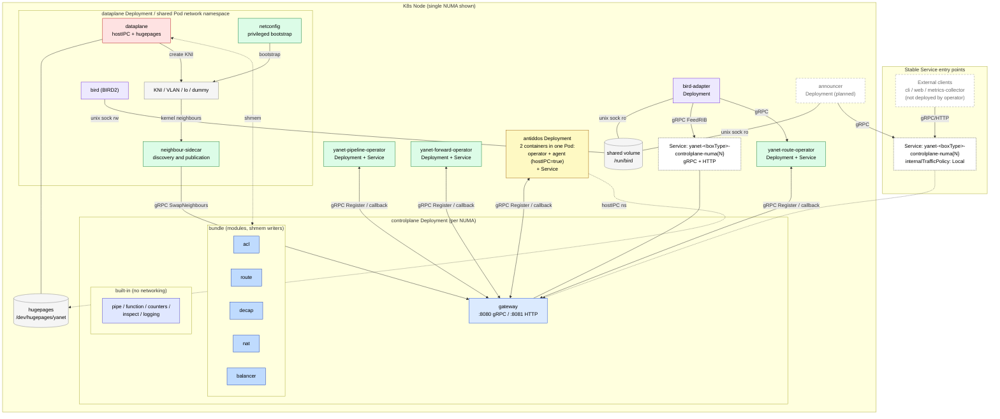

# YANET2 — Target Architecture for yanet-operator

> This document describes the target architecture of yanet2 on a Kubernetes
> node that yanet-operator must be able to generate (CRD `v1alpha1`).
> Sources: yanet2 developers + production config samples from
> `/etc/yanet2/`.

## 1. Terminology

| Term | Meaning |
|---|---|
| **Module** | Code that obtains an *arena* from the dataplane and writes to shmem via the IPC namespace; compiles data into a binary format. May live either inside the `controlplane` or as a standalone process. Examples: `acl`, `route`, `decap`, `nat64`, `balancer`, `forward`. |
| **Operator** | Userspace wrapper around a module. Holds the pre-compilation ("source") state, supplies data to be compiled, talks gRPC with other entities (via `gateway`), and collects metrics. Examples: `yanet-pipeline-operator`, `yanet-route-operator`, `yanet-forward-operator`. |
| **Agent** | An operator container that also accesses shared memory. Its mounts and any Pod IPC requirements are explicit Deployment patches. Planned example: `antiddos`. |
| **Bundle** | A set of modules inside `controlplane` that work via shmem: `acl`, `route`, `decap`, `nat`, `balancer`. |
| **Built-in** | Services inside `controlplane` that do not perform networking tasks but are required to assemble the pipeline: `pipe`, `function`, `counters`, `inspect`, `logging`. They are auto-registered in the gateway (see [`gateway.go`](../yanet2/controlplane/internal/gateway/gateway.go:179)). |
| **Gateway** | gRPC + HTTP/gRPC-proxy inside `controlplane`. The registration entry point for external operators (`Register` in [`service.go`](../yanet2/controlplane/internal/gateway/service.go:63)) and the entry point for CLI / web / metrics-collector. |
| **NUMA-domain** | One `controlplane` per NUMA domain on the host (a separate Deployment) plus its own shmem arena in dataplane. |

## 2. Node Composition

### 2.1. Base data path / control path

| Component | Deployment | IPC / network | Config |
|---|---|---|---|
| `dataplane` (`yanet-dataplane`) | One Deployment per node | Private Pod network, `hostIPC: true`, hugepages, shmem `/dev/hugepages/yanet`; native sidecars share its network namespace | hostPath (`/etc/yanet2/dataplane.yaml`) |
| `controlplane` (`yanet-controlplane-director`) | One Deployment **per NUMA domain** | gRPC `[::]:8080` / HTTP `[::]:8081` (inside the Pod), `hostIPC` | hostPath or inline; `{numa}` explicitly selects per-NUMA files |
| `metrics-collector` | DaemonSet (out of yanet-operator scope in Phase 4) | gRPC to gateway service | — |

### 2.2. Dataplane network sidecars and BIRD

| Component | Deployment | Wiring |
|---|---|---|
| `bird` (BIRD2) | Native sidecar in the dataplane Pod | hostPath config; owns `/run/bird`; shares dataplane network namespace |
| `netconfig` | Generic single-container sidecar in the dataplane Pod | bootstraps KNI/VLAN/lo/dummy; privileged for netlink and per-interface IPv6 sysctls; read-only `/etc/netconfig` and `/etc/netplan`; no RPC listener |
| `neighbour-sidecar` | Generic single-container sidecar in the dataplane Pod | observes kernel neighbours and publishes `SwapNeighbours` through outbound gateways; own gRPC `Ready/Watch`; read-only config, no interface-configuration privileges |
| `bird-adapter` (`yanet-bird-adapter`) | Standalone Deployment | shared `/run/bird` (reads BIRD socket); gRPC → gateway service and/or route-operator service |

> All three use `spec.components.dataplane.sidecars[]`, an ordered atomic list of
> `SidecarSpec` (`name`, `image`, `config`, `listeners`). Each entry creates exactly
> one restartable init container (`restartPolicy: Always`). Box types select names
> through `components.dataplane.sidecars`; startup and port slots follow the complete
> palette order, including disabled/unselected entries. BIRD, neighbour-sidecar,
> netconfig reserve respectively 8080/8081, 8082/8083 and 8084/8085.
> During migration, stop the old operator and delete its standalone v2 BIRD
> Deployments before enabling this sidecar. Both variants own the node-local
> `/run/bird` control-socket directory and cannot run concurrently.

BIRD is optional and has no name-based dependency checks in the controller.
Declare its config, socket mounts, ports and permissions through scoped patches;
declare socket mounts for its consumers separately.

Netconfig must retry absent KNI asynchronously: dataplane creates KNI only after
the native sidecars start. No blocking init/PostStart hook or runtime Kubernetes
probes are configured. Announcer owns application readiness decisions through
YANET gRPC readiness APIs; operator consumption of these APIs is deferred.
Neighbour-sidecar does not register with gateway. For a managed host config its
bind is overridden to `[::]:8082`; `[grpc]` creates a Service on external port 8080,
while `[]` leaves the bind/gateway env but suppresses the Service.
It reports publication status, not FIB/forwarding readiness.

There are no fixed BIRD/netlink slots. See the
[full example](deploy/examples/v1alpha1-yanetconfig-full.yaml) for separate images,
config mounts, and the netconfig-specific security patch. Image release/pinning,
host config generation, and a real Kubernetes forwarding smoke are rollout steps.

### 2.3. Operators and Agents

The list comes from `spec.components.operators[]` and creates standalone
Deployments. Dataplane roles use the separate sidecar list. Service-backed roles receive a shared box-type
ClusterIP Service. Explicit `listeners: []` suppresses managed listeners and
Services. Registering operators talk bidirectionally with gateway; the two
network sidecars above do not register.

| Operator | Binary | Example config file |
|---|---|---|
| pipeline | `yanet-pipeline-operator` | [`yanet-pipeline-operator.yaml`](../yanet2/agents/yanet-pipeline-operator) |
| route | `yanet-route-operator` | [`yanet-route-operator.yaml`](../yanet2/agents/yanet-route-operator) |
| forward | `yanet-forward-operator` | (see `yanet2/agents/yanet-forward-operator`) |
| acl | `yanet-operator-acl` | `/etc/yanet/operator-acl.yaml` |
| (planned) antiddos | operator + agent in one Pod | — |

Agents use the same container-group API as operators. Two shapes are supported:

- **Single-container Deployment** — the most common case (`pipeline`, `route`,
  `forward`, `acl`).
- **Multi-container Deployment** — needed when an operator and a paired agent
  must live in **the same Pod** (shared lifecycle, shared volumes, the same
  IPC/network namespaces). The reference case is `antiddos`: an `operator`
  container + an `agent` container with an explicitly patched shared-memory mount.

The CRD models each item via `containers[]`:
single-container is `containers: [{...}]`, multi-container is
`containers: [{name: operator, ...}, {name: agent, ...}]`.
There is no container-level `hostIPC` field and no inferred hugepages mount.
Set `spec.template.spec.hostIPC` when required, declare the shared volume, and
mount it only into the intended containers through a Deployment patch.

### 2.4. Announcer

- Standalone Deployment declared as an ordinary `operators[name=announcer]`.
- Watches host health and decides whether the node should be in service.
- Readiness targets are direct application gRPC endpoints configured in `operators[]`.
- Additionally needs the **bird unix socket** (shared volume `/run/bird`)
  in order to withdraw the announcement when controlplane fails.

### 2.5. What yanet-operator does NOT deploy

- yanet-cli, web UI — external clients, they reach the gateway service.
- metrics-collector — separate DaemonSet (not covered in Phase 4).
- BIRD config — for now mounted from the host.

## 3. Service Topology

Created by yanet-operator and owned by the cluster-scoped `YanetConfig/config`:

| Service | Selector | Type / policy | Purpose |
|---|---|---|---|
| `yanet-<boxType>-controlplane-numa{N}` | `box-type=<boxType>,component=controlplane,numa=N` | ClusterIP, `internalTrafficPolicy: Local` | Reach the local gateway for one NUMA role; exposes `grpc:8080` and `http:8081` |
| `yanet-<boxType>-<operator>` | `box-type=<boxType>,component=<operator>` | ClusterIP, `internalTrafficPolicy: Local` | Stable address advertised by an operator for gateway callbacks on `grpc:8080` |
| `yanet-<boxType>-announcer` | `box-type=<boxType>,component=announcer` | ClusterIP, `internalTrafficPolicy: Local` | Internal announcer entry point on `grpc:8080` |

Services are unconditional for service-backed roles wired by a box type, even when an
installation or component has zero replicas. Their selectors omit Yanet and node
identity so installations of the same box type share the stable DNS names in a
namespace. Named targets resolve standalone `8080/8081` or the sidecar's reserved
pair, with stable external `8080/8081`. Sidecars use membership-label selectors.

Every role defaults omitted listeners to `[grpc]`; metrics must explicitly select
`[http]`. `listeners: []` disables Service exposure, not the slot or host-config env.
Only the managed config volume after patches enables the HostPath overlay; inline
ConfigMap/no-config roles receive none. Runtime gateway env selects active
physical `numa<N>` entries and preserves their TLS. See
[the environment contract](ARCHITECTURE.md#listener-endpoint-configuration).

## 4. Dependencies

- **Kubernetes 1.33+** — required so EndpointSlice resolves named Service
  target ports exposed by restartable init-container sidecars.
- Host requirements: hugepages, `hostIPC`, DPDK devices, and netplan input.
  Final `hostNetwork: true` and nonzero `hostPort` are unsupported.
- Compatible runtime images and prepared host configs for named gateway overrides.
  ACL runtime support is an external integration prerequisite.

## 5. Mermaid diagram

> Simplified single-NUMA view (in production a node has N NUMA domains and N
> `controlplane` Deployments). Modules live **inside** `controlplane` (bundle).
> Standalone operators run outside `controlplane`. BIRD, netconfig and
> neighbour-sidecar share the dataplane Pod. The BIRD unix socket
> (`/run/bird`) is also mounted into `bird-adapter` and `announcer`.


```mermaid
flowchart TB
    classDef host fill:#f5f5f5,stroke:#888,color:#000
    classDef cp fill:#dbeafe,stroke:#1d4ed8,color:#000
    classDef mod fill:#bfdbfe,stroke:#1e40af,color:#000
    classDef builtin fill:#e0e7ff,stroke:#4338ca,color:#000
    classDef dp fill:#fee2e2,stroke:#b91c1c,color:#000
    classDef op fill:#dcfce7,stroke:#15803d,color:#000
    classDef agent fill:#fef9c3,stroke:#a16207,color:#000
    classDef bird fill:#ede9fe,stroke:#6d28d9,color:#000
    classDef svc fill:#fff,stroke:#444,stroke-dasharray:3 2,color:#000
    classDef plan fill:#fff,stroke:#999,stroke-dasharray:5 4,color:#666

    subgraph TOP[" Stable Service entry points "]
        direction LR
        EXT["External clients<br/>cli / web / metrics-collector<br/>(not deployed by operator)"]:::plan
        SVCNUMA["Service: yanet-&lt;boxType&gt;-controlplane-numa{N}<br/>internalTrafficPolicy: Local"]:::svc
        EXT -->|gRPC/HTTP| SVCNUMA
    end

    subgraph NODE[" K8s Node (single NUMA shown) "]
        direction LR

        HUGE[("hugepages<br/>/dev/hugepages/yanet")]:::host
        BIRDSOCK[("shared volume<br/>/run/bird")]:::host

        subgraph DPPOD[" dataplane Deployment / shared Pod network namespace "]
            DP["dataplane<br/>hostIPC + hugepages"]:::dp
            NC["netconfig<br/>privileged bootstrap"]:::op
            NS["neighbour-sidecar<br/>discovery and publication"]:::op
            KNI["KNI / VLAN / lo / dummy"]:::host
            BIRD["bird (BIRD2)"]:::bird
        end

        subgraph CP[" controlplane Deployment (per NUMA) "]
            direction TB
            GW["gateway<br/>:8080 gRPC / :8081 HTTP"]:::cp
            subgraph BUNDLE[" bundle (modules, shmem writers) "]
                MOD_ACL["acl"]:::mod
                MOD_ROUTE["route"]:::mod
                MOD_DECAP["decap"]:::mod
                MOD_NAT["nat"]:::mod
                MOD_BAL["balancer"]:::mod
            end
            subgraph BIN[" built-in (no networking) "]
                BI["pipe / function / counters /<br/>inspect / logging"]:::builtin
            end
        end

        SVCCP["Service: yanet-&lt;boxType&gt;-controlplane-numa{N}<br/>gRPC + HTTP"]:::svc
        SVCCP --- GW

        OP_PIPE["yanet-pipeline-operator<br/>Deployment + Service"]:::op
        OP_ROUTE["yanet-route-operator<br/>Deployment + Service"]:::op
        OP_FWD["yanet-forward-operator<br/>Deployment + Service"]:::op

        AG_DDOS["antiddos Deployment<br/>2 containers in one Pod:<br/>operator + agent (hostIPC=true)<br/>+ Service"]:::agent

        BADAPT["bird-adapter<br/>Deployment"]:::bird
        ANN["announcer<br/>Deployment (planned)"]:::plan
    end

    %% dataplane <-> controlplane via shmem (host IPC)
    DP <-. shmem .-> BUNDLE
    DP --- HUGE
    DP -->|create KNI| KNI
    NC -->|bootstrap| KNI
    KNI -->|kernel neighbours| NS
    NS -->|gRPC SwapNeighbours| GW

    %% Operators register with gateway and serve callbacks
    OP_PIPE  <-->|gRPC Register / callback| GW
    OP_ROUTE <-->|gRPC Register / callback| GW
    OP_FWD   <-->|gRPC Register / callback| GW
    AG_DDOS  <-->|gRPC Register / callback| GW

    %% Antiddos agent container needs host IPC
    AG_DDOS -. hostIPC ns .-> HUGE

    %% BIRD publishes its socket from the dataplane Pod
    BIRD   ---|unix sock rw| BIRDSOCK
    BADAPT ---|unix sock ro| BIRDSOCK
    ANN    ---|unix sock ro| BIRDSOCK

    %% bird-adapter -> route side
    BADAPT -->|gRPC FeedRIB| SVCCP
    BADAPT -->|gRPC| OP_ROUTE

    %% announcer -> gateway
    ANN -->|gRPC| SVCNUMA

    %% Stable per-NUMA Service points to the local gateway
    SVCNUMA -.-> GW
```

> The diagram shows **one** NUMA domain. For an N-NUMA host the operator
> generates N copies of the `controlplane Deployment` and matching
> `yanet-<boxType>-controlplane-numa{N}` Services
> (see §3 above).

## 6. Configuration contract

`components` declares the palette; `boxTypes` selects components and ordered
Deployment patches; `Yanet` selects a box and per-installation overrides.
The current types and runnable examples are the source of truth:

- [Operator API](api/v1alpha1/yanetconfig_types.go).
- [Full configuration](deploy/examples/v1alpha1-yanetconfig-full.yaml).
- [Rendering and ownership](ARCHITECTURE.md).

There is no fixed announcer/BIRD/netlink slot, placement switch, host-network
allocator or auto-discovery. Announcer is an ordinary operator; BIRD and the
network sidecars are declarations in `dataplane.sidecars[]`.

## 7. Component Config Sources

CRD `v1alpha1` introduces a unified `config` schema (shared by controlplane,
dataplane, dataplane native sidecars, all operators / agents / announcer):

```yaml
config:
  # variant 1 — inline in the CR (translated into a ConfigMap)
  inline: |
    logging: { level: info }
    ...
  # variant 2 — hostPath
  hostPath: /etc/yanet2
  # Optional container directory; default /etc/yanet2
  mountPath: /etc/yanet2
```

Exactly **one** of the variants may be specified. Validation lives in the webhook.
Remote configuration downloads are entirely described by Deployment patches:
an init container, an emptyDir, and the consumer mounts/args. The typed API
does not offer an unimplemented URL source.

## 8. Open Questions / Deferred

- metrics-collector support in yanet-operator — **later** (DaemonSet is deployed separately).
- CLI / web — out of scope.
- Legacy API compatibility/conversion is unsupported. The operator serves only
  the component-based `v1alpha1` API; see [release notes](release-notes/v3.0.0.md).
